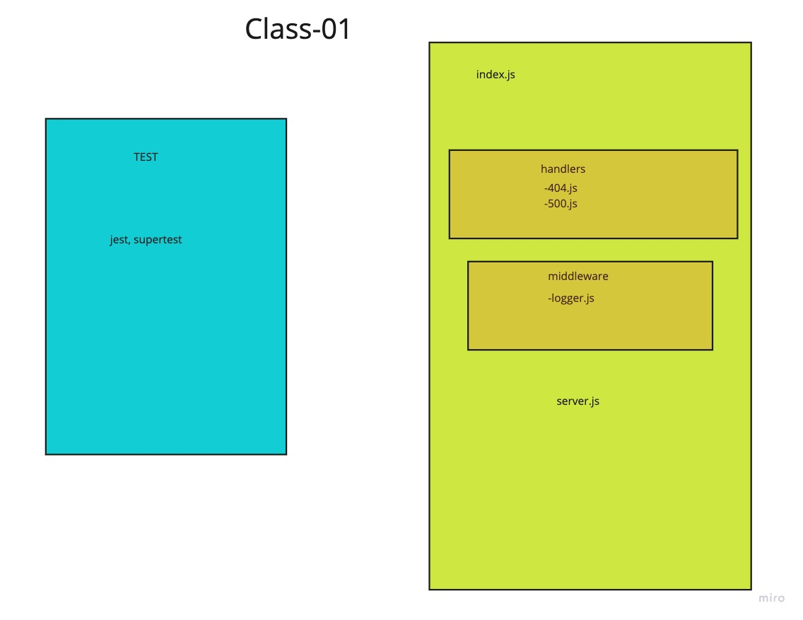

# LAB - Class 01

## Project: Basic Express Server

### Author: Steven Rejdukowski

### Problem Domain

Create a web server using CI and CD

### Links and Resources

- [ci/cd](https://github.com/Stevenrej/basic-express-server/actions) (GitHub Actions)
- [prod deployment](https://basic-express-server-prod-5hr5.onrender.com/)

### Setup

#### `.env` requirements (where applicable)

see `.env.sample`

- PORT: 3001

#### How to initialize/run your application (where applicable)

- nodemon

#### Features / Routes

- Feature One: Deploy to Prod
- GET : `/`
- GET : `/bad`
- GET : `/helloPath/:individual`
- GET : `/person`

#### Tests

- How do you run tests?
npm test
- Any tests of note?
- handles root path
- handles invalid requests
- hanldes errors

#### UML

